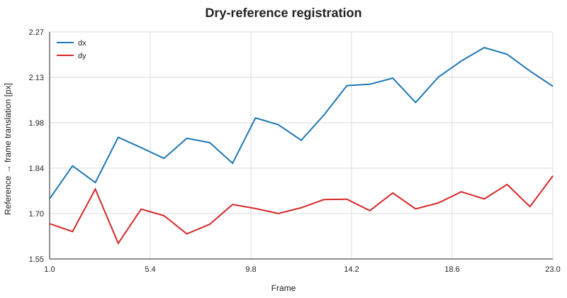
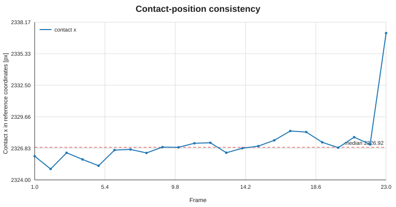
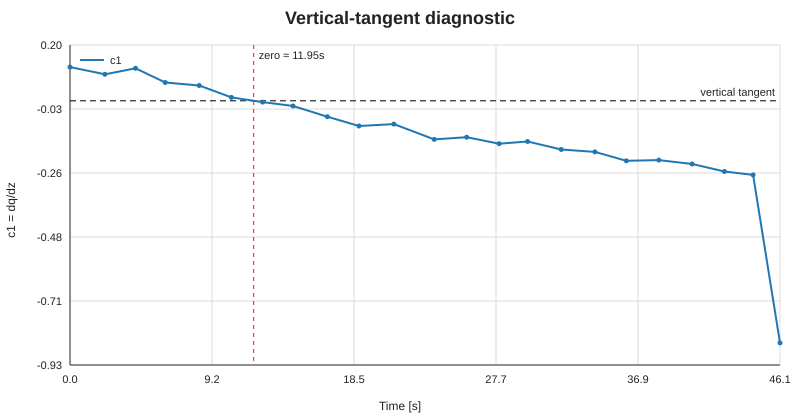
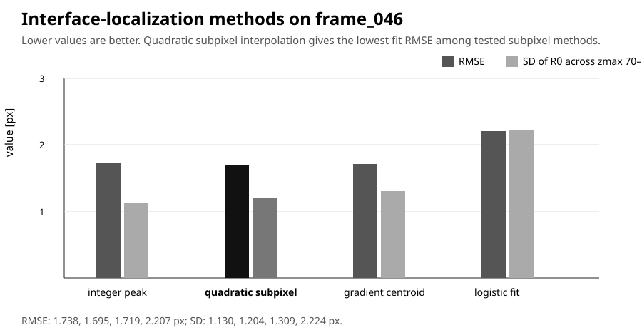
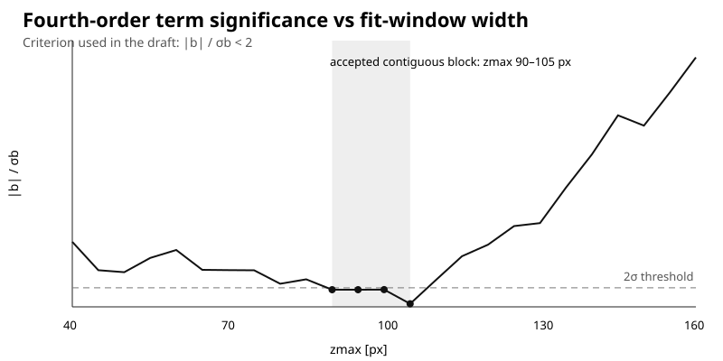

# Flat-drop method validation

Stručný validační report obrazového vyhodnocení lokální geometrie ploché kapky pro připravovanou flat-drop tenziometrickou metodu. Produkční program je veden samostatně v repozitáři `drop-analysis`; tento repozitář dokumentuje volbu algoritmů a obsahuje [implementační specifikaci](implementation-spec.md), která má být pro Codex hlavním zadáním.

> **Stav:** metoda byla nově ověřena také na celém projektu obsahujícím **dry reference + 23 snímků postupného plnění (0–46.12 s)**. Číselné hodnoty v pixelech slouží k validaci obrazového algoritmu, nikoli zatím jako finální metrologický výsledek povrchového napětí.

## 1. Co ukázala celá dávka

Analýza kompletní sekvence zpřesnila původní návrh ve čtyřech důležitých bodech:

| Otázka | Zjištění na této dávce | Důsledek pro implementaci |
|---|---|---|
| Kde vzít výšku rim? | Horní rovina misky je v dry reference velmi dobře viditelná a lze ji fitovat přes široký úsek. | `y0` a natočení souřadnic určovat z dry reference. |
| Je nutná registrace? | Mezi dry reference a burstem byl nalezen obrazový posun přibližně **+1.74 až +2.22 px v x** a **+1.60 až +1.81 px v y**. | Každý liquid frame registrovat ke statické ROI reference; nespoléhat jen na mechanicky nehybnou kameru. |
| Lze z dry reference určit i radiální contact point? | Dry silhouette ukazuje vnější roh, ale skutečný liquid-air interface začíná na vnitřní hraně před malou ploškou doprava. | **Radiální contact position se nemá odvozovat z vnějšího silhouette corneru.** Určit jej z liquid frames a kontrolovat jeho konzistenci napříč sekvencí. |
| Jak objektivně najít optimální naplnění? | Diagnostický lineární člen lokálního fitu mění znaménko mezi `frame_006` a `frame_007`; lineární interpolace dává přibližně **t0 = 11.95 s**. | Optimální stav hledat numericky přes nulovou směrnici, ne subjektivním výběrem snímku. |



## 2. Rim reference: co je statické a co se musí odvodit z kapaliny

### Z dry reference

Z prvního snímku bez kapaliny určit:

- rovinu horní hrany misky (`rim plane`),
- její případný sklon a rektifikaci obrazu,
- prostorovou kalibraci,
- statickou ROI vhodnou pro registraci dalších snímků.

Na aktuální referenci byl horní silhouette edge fitován přibližně jako

```text
y(x) = 966.627 + 0.000363 x
```

s reziduální SD asi **0.34 px** pro použitý soubor silných hranových bodů. Hodnota je pouze diagnostika této konkrétní reference.

### Z liquid frames

Výšková rovina `z = 0` je již dána registrovanou dry reference. Radiální poloha skutečné contact edge se ale určí extrapolací liquid-air interface k této rovině.

Pro krátký lokální interval je vhodný diagnostický fit

```text
x(z) = xc + s z + c2 z²
```

kde `xc` je extrapolovaná horizontální poloha kontaktu v `z = 0`.

V aktuální sekvenci tvoří `frame_001` až `frame_022` kompaktní cluster `xc`; robustní medián v souřadnicích dry reference je **2326.923 px**, MAD **0.485 px**. `frame_023` leží přibližně **+10.27 px**, tj. **21.2 MAD**, mimo tento cluster. Z obrazu samotného zde neurčujeme fyzikální příčinu skoku; program jej má především spolehlivě detekovat a označit jako změnu contact-position / QC outlier.



## 3. Objektivní nalezení vertikální tečny

Po určení společné pinned contact position lze pro každý snímek použít krátký diagnostický fit

```text
q = c1 z + a z²
q = x0 - x
```

`c1 = 0` odpovídá vertikální tečně v rim plane. Na této dávce `c1` přechází přes nulu mezi snímky 6 a 7; interpolace časových metadat dává přibližně `t0 = 11.95 s`.



Tento krok je určen pro **frame selection/QC**, nikoli jako náhrada finálního curvature fitu.

## 4. Detekce liquid-air interface

Na samostatném testovacím snímku byly porovnány čtyři způsoby subpixelové lokalizace rozhraní:

| Metoda | Rθ při zmax = 100 px [px] | RMSE [px] | SD Rθ pro zmax 70–110 px [px] | Hodnocení |
|---|---:|---:|---:|---|
| Integer gradient peak | 116.159 | 1.738 | **1.130** | stabilní, ale celočíselná poloha |
| **Quadratic subpixel gradient peak** | **115.902** | **1.695** | 1.204 | **zvolená varianta** |
| Gradient centroid | 115.757 | 1.719 | 1.309 | bez zlepšení |
| Logistic intensity-edge fit | 113.758 | 2.207 | 2.224 | méně stabilní na testovaném obrazu |

**Doporučená metoda:** maximum horizontálního gradientu + tříbodová kvadratická subpixelová interpolace maxima.



## 5. Curvature fit: důležité zpřesnění

Původní testy ukázaly vysokou citlivost `Rθ` na vynucenou absolutní radiální polohu `(x0)`. Celá dávka potvrzuje, že **absolutní horizontální intercept nemá být při curvature fitu natvrdo fixován na obrazovou polohu rim**. Pro křivost jsou rozhodující derivace profilu; radiální intercept má být volný parametr regresního modelu.

Pro frame blízko vertikální tečny je article-aligned lokální model

```text
x(z) = c0 + c2 z²
Rθ = 1 / (2 |c2|)
```

kde `c0` je volný obrazový intercept. Jako diagnostický obecnější model se současně počítá

```text
x(z) = c0 + c1 z + c2 z²
Rθ,general = (1 + c1²)^(3/2) / (2 |c2|)
```

V limitě `c1 -> 0` se obecný vztah redukuje na parabolický vztah použitý v draftu článku. Produkční article-aligned výsledek má být nadále získáván z near-vertical frames; obecný model slouží především ke kontrole sklonu a robustnosti.

## 6. Automatická volba šířky lokálního fitu

Pevná délka fitu se nedoporučuje. Pro postupně rostoucí `zmax` se na near-vertical frame testuje

```text
x = c0 + c2 z²
x = c0 + c2 z² + c4 z⁴
```

a lokální interval je z hlediska vyššího členu přijatelný, pokud

```text
|c4| < 2 sigma_c4
```

Toto je obrazová implementace kritéria `|b| < 2σb` formulovaného v draftu článku. Přijatelný blok musí navíc vykazovat stabilní `Rθ`; numerický limit stability zůstává konfigurovatelný, protože ještě nebyl ověřen na dostatečném počtu nezávislých měření.



## 7. Plateau a výška h

Plateau se vyhodnocuje odděleně od side curvature. V široké levé ROI se detekuje horní liquid-air interface vertikálním gradientem a jeho úroveň se vztáhne k registrované rim plane.

V této sekvenci rostla detekovaná obrazová výška monotónně přibližně z **238.78 px** (`frame_001`) na **281.93 px** (`frame_023`), což odpovídá pořadí postupného plnění a poskytuje další jednoduchou QC kontrolu série.

## 8. Současná doporučená pipeline

```text
PROJECT ZIP
  ├── project.json
  ├── reference/apparatus_reference.png
  └── frames/*.png
          ↓
DRY REFERENCE
  rim plane + rotation + calibration + static registration ROI
          ↓
REGISTER EVERY LIQUID FRAME TO REFERENCE
          ↓
LIQUID-AIR INTERFACE EXTRACTION
  horizontal gradient maximum
  + 3-point quadratic subpixel interpolation
          ↓
CONTACT-POSITION ESTIMATE PER FRAME
  x(z) = xc + s z + c2 z²
          ↓
ROBUST COMMON CONTACT CLUSTER
  flag contact-position outliers
          ↓
TANGENT DIAGNOSTIC
  q = c1 z + a z²
  find c1 ≈ 0 / zero crossing → t0
          ↓
PLATEAU FIT → h
          ↓
LOCAL CURVATURE FIT ON NEAR-VERTICAL FRAMES
  free radial intercept
  expanding zmax
  quadratic vs quadratic + z⁴
          ↓
|c4| < 2 sigma_c4 + stable Rθ
          ↓
Rθ + diagnostics + QC
```

## 9. Co má Codex implementovat

Za autoritativní technické zadání považuj **[implementation-spec.md](implementation-spec.md)**. README je stručný validační report a zdůvodnění výběru metod.

Aktuální numerické podklady:

- [celá dávka: registrace, h, contact position a tangent diagnostic](results/batch-validation.csv)
- [porovnání metod detekce rozhraní](results/edge-method-comparison.csv)
- [původní diagnostika fitovacích oken](results/frame046-fit-window-diagnostics.csv)

## 10. Otevřené body před finální metrologickou validací

- numerický limit stability `Rθ` v akceptovaném `zmax` bloku,
- optimální `zmin` a rozsah krátkého contact/tangent diagnostického fitu,
- px/mm kalibrace a úplná propagace nejistot,
- opakovatelnost na nezávislých filling sequences,
- fyzikální interpretace změny contact-position v posledním snímku této konkrétní dávky není z obrazu samotného určena a pro algoritmus není předpokládána.

---

### Shrnutí

Celá dávka výrazně zpřesnila návrh: **dry frame určuje výškovou geometrii a registraci, liquid frames určují skutečnou contact position, nulový lineární člen objektivně lokalizuje stav s vertikální tečnou a curvature fit nesmí být citlivý na natvrdo vynucený horizontální intercept.** Tato architektura je nyní doporučeným základem pro implementaci v `drop-analysis`.
