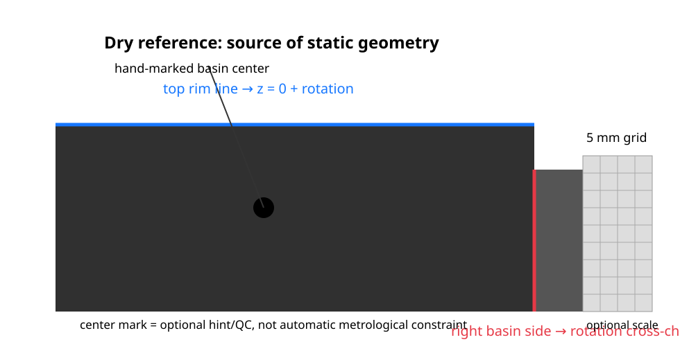

# Implementation specification for `drop-analysis`

This document is the **authoritative implementation target** for the flat-drop image-analysis workflow. It reflects the current scientific draft, the supplied dry reference, and the complete filling sequence. The production repository `drop-analysis` should implement this specification without importing assumptions from the existing `needle` mode.

## 1. Acquisition model

A project contains:

```text
one dry reference frame
+ a time-ordered sequence of liquid frames
```

The camera/apparatus is nominally fixed. Water is added progressively so that the sequence passes from underfilled, through the vertical-tangent condition, to overfilled relative to the ideal state.

**Every liquid frame must be analyzed independently.** The software may calculate diagnostics and rank/highlight frames, but it must not automatically reduce the sequence to one selected frame. The operator will decide which frames are physically suitable for the final evaluation.

The sequence is intentionally useful for two purposes:

- locating the state closest to a vertical tangent;
- demonstrating how robust the derived quantities are when the filling is only approximately optimal.

## 2. Dry reference = source of static apparatus geometry

The dry reference is the source of truth for quantities that do not belong to the liquid profile.

Use it to determine:

1. **top rim line** — physical reference plane `z = 0`;
2. **right vertical side of the basin** — independent orientation reference;
3. **image rotation / rectification**;
4. **static ROI(s)** for registering liquid frames back to the reference;
5. **optional spatial scale**;
6. **optional basin-center marker** as a hint/QC feature.



### 2.1 Orientation / rectification

Fit the top rim edge over a wide span and fit the right basin side over a wide vertical span.

Default behavior:

- estimate one rigid image rotation from the static reference geometry;
- after rectification, the top rim should be horizontal and the right side approximately vertical;
- store residual angles/errors as QC diagnostics.

Do not introduce perspective/projective correction by default. If the two fitted lines cannot be made mutually consistent by a rigid rotation within a configurable tolerance, report this as a geometry/QC condition rather than silently warping the image.

### 2.2 Rim height

The **top rim line from the dry reference** defines the vertical zero.

Do not infer rim height from the bright lower ledge visible in strongly illuminated liquid frames. With a large drop this optical feature can appear lower than the physical rim.

### 2.3 Right side

The right basin side is a static geometric reference for orientation and registration. It is **not automatically identical to the liquid contact x-coordinate**; the actual liquid-air interface begins at the inner sharp edge and a small ledge continues to the right.

Therefore the dry reference defines the static basin geometry, while the liquid profile still determines where the liquid-air interface intersects the rim plane.

### 2.4 Scale

The graph paper visible on the right side of the reference has **5 mm squares**.

Scale calibration is useful but must not block the flat-drop fitting implementation.

Preferred implementation order:

1. allow a stored/manual `px_per_mm` calibration;
2. optionally implement a simple grid-based calibration from the 5 mm paper;
3. do not require sophisticated automatic grid analysis for the first flat-drop implementation.

All image-space results must remain available even if physical scale is not yet resolved.

### 2.5 Hand-marked basin center

A marker on the dry basin indicates its approximate center.

Treat it as:

- an optional ROI/initialization hint;
- an optional QC check against other static geometry.

Do **not** use the hand mark as a hidden high-precision metrological constraint unless the user explicitly chooses to do so. The physical `Rphi` used by the scientific method remains a mechanically/calibrationally defined quantity.

## 3. Registration of every liquid frame

Even though the camera is nominally fixed, register each liquid frame to the dry reference using only static apparatus/background features.

Do not register from the liquid-air interface.

The supplied batch showed a measurable dry-reference-to-liquid-frame image offset, so copying the dry geometry to identical pixel coordinates is not sufficient.

Implementation requirements:

- estimate at least translation;
- apply the transform before using the dry rim plane;
- save transform + registration quality per frame;
- expose registration failure/warning explicitly;
- keep thresholds configurable.

The reference top/right geometry can also be used as an independent consistency check after registration.

## 4. Coordinate system

After registration and rectification define:

```text
z = 0       physical top rim plane from dry reference
z > 0       upward into the liquid
x           rectified horizontal image coordinate
```

Use pixel units internally unless/ until `px_per_mm` is available.

## 5. Plateau height `h`

Determine plateau and side curvature independently.

For each liquid frame:

1. use a wide ROI away from the right-hand curvature;
2. locate the upper liquid-air transition by vertical intensity gradient;
3. refine the edge subpixel-wise;
4. fit the plateau line/level robustly;
5. calculate `h` relative to the registered dry `z = 0` rim plane.

Save the plateau fit and its residuals/uncertainty.

For a monotonic filling sequence, `h` should be reported for every frame so the operator can inspect its progression; do not use monotonicity as a universal hard rejection rule.

## 6. Side liquid-air interface extraction

Use a right-side ROI around the curved liquid-air boundary.

For each image row:

1. compute the horizontal intensity gradient;
2. locate the positive gradient maximum corresponding to liquid -> background;
3. refine the peak using three-point quadratic subpixel interpolation;
4. store the subpixel interface coordinate.

### Selected default

**Horizontal gradient maximum + three-point quadratic subpixel interpolation.**

This was the best current compromise on the tested image among:

- integer gradient peak;
- quadratic subpixel gradient peak;
- gradient centroid;
- logistic intensity-edge fit.

Keep the extractor modular so alternatives can still be compared diagnostically, but do not use the logistic fit as the current default.

## 7. Per-frame contact/tangent diagnostic

For each registered liquid frame, use a short configurable near-rim interval and fit

```text
x(z) = xc + s*z + c2*z^2
```

with a free intercept.

Outputs:

- `xc`: extrapolated intersection of the local interface with `z = 0`;
- `s`: local tangent/slope diagnostic;
- fit uncertainty and residuals.

A sequence-level plot of `xc` is useful to reveal contact-position changes, but **do not automatically discard a frame solely because it differs from the main cluster**. Flag it and let the operator decide, unless the actual profile fit itself fails.

The current batch exhibits one strong contact-position change at the final frame; the algorithm should report the discontinuity without assigning an unverified physical cause.

## 8. Vertical-tangent diagnostic

A frame close to the ideal state can also be represented locally by

```text
q = c1*z + a*z^2
```

where the coordinate convention is chosen so that

```text
c1 = 0  <=>  vertical tangent at the rim plane
```

The supplied sequence shows a sign change of this diagnostic between frames 006 and 007, with an interpolated zero near 11.95 s in the current prototype analysis.

Use `c1` to:

- show which frame is closest to the ideal condition;
- order frames from “before” to “after” the vertical-tangent state;
- support robustness plots.

**Do not use `c1` to automatically select/reject frames.** Every successfully fitted frame remains in the output.

Do not convert `c1` to `DeltaPsi` until the exact angle convention has been explicitly verified against the scientific definition.

## 9. Curvature fit for every frame

Every liquid frame that has a usable extracted side interface must receive its own curvature fit.

The operator, not the software, decides which frames are later accepted for scientific reporting.

### 9.1 Free radial intercept

Do not force the fitted image intercept to a preselected `x0`.

For the article-aligned local parabolic fit use

```text
x(z) = c0 + c2*z^2
```

with free `c0`.

Then

```text
Rtheta = 1 / (2*abs(c2))
```

in pixel units before optional scale conversion.

The free additive intercept does not affect curvature and avoids making `Rtheta` artificially sensitive to a subpixel error in the absolute contact x-position.

### 9.2 General diagnostic curvature

Also fit

```text
x(z) = c0 + c1*z + c2*z^2
```

and optionally calculate

```text
Rtheta_general = (1 + c1^2)^(3/2) / (2*abs(c2))
```

at `z = 0`.

Keep this as a diagnostic/cross-check. Do not silently replace the article-aligned result with it.

## 10. Adaptive local fit window — independently for every frame

Do not use one fixed profile length.

For each frame separately, sweep progressively increasing `z_max` and compare

```text
x = c0 + c2*z^2
x = c0 + c2*z^2 + c4*z^4
```

Estimate `sigma_c4` and mark a candidate interval as locally parabolic with respect to the higher-order term when

```text
abs(c4) < 2*sigma_c4
```

This is the implementation form of the scientific-draft criterion `|b| < 2 sigma_b`.

For each frame save the **entire fit-window sweep**, not only one chosen window:

- `z_min`, `z_max`;
- number of interface points;
- `c0`, `c2`, `Rtheta`;
- uncertainty of `Rtheta`;
- RMSE;
- `c4`, `sigma_c4`, `abs(c4)/sigma_c4`;
- stability diagnostics across neighboring windows.

The program may propose/highlight a preferred stable window, but the full sweep must remain inspectable and the operator must be able to override the choice.

Keep configurable:

- `z_min`;
- `z_max` increment;
- minimum fit points;
- minimum accepted contiguous block length;
- numerical `Rtheta`-stability threshold.

No currently tested value is universal.

## 11. Required behavior: no automatic scientific frame selection

This rule supersedes earlier prototypes that selected a `t0` neighborhood automatically.

The final implementation must:

1. process **all liquid frames independently**;
2. calculate `h`, side profile, tangent diagnostics and curvature diagnostics for each frame;
3. preserve every successful result;
4. flag QC conditions without silently deleting the result;
5. provide ordering/highlighting by `c1`, time, fit quality, contact-position change, etc.;
6. leave scientific acceptance to the human operator.

This directly supports the intended experiment: compare underfilled, near-ideal and overfilled states and assess robustness around the vertical-tangent condition.

## 12. Required per-frame outputs

Save at least:

- frame index and timestamp;
- registration transform + quality;
- registered/rectified rim geometry;
- plateau level, `h`, uncertainty/fit residual;
- extracted side-interface points;
- per-frame contact intercept `xc`;
- tangent coefficient (`s`/`c1`) + uncertainty;
- complete adaptive-window sweep;
- proposed preferred window, if any;
- `Rtheta` + uncertainty for that proposed window;
- optional `Rtheta_general`;
- RMSE;
- higher-order significance metric;
- QC flags/warnings;
- diagnostic overlay.

## 13. Required sequence-level outputs

The sequence view/report should contain all frames and allow the operator to choose.

Save/show at least:

```text
h vs frame/time
xc vs frame/time
c1 vs frame/time
Rtheta vs frame/time
Rtheta vs c1
fit-quality/QC status vs frame
```

When physical scale and the remaining physical inputs are enabled, equivalent plots may be added for derived quantities such as surface tension.

Highlighting the frame nearest `c1 = 0` is useful, but it is advisory only.

## 14. Diagnostic overlay

Every frame should be visually auditable during method development.

Overlay at least:

- registered dry rim plane;
- reference-derived orientation;
- plateau edge/fit;
- extracted side-interface points;
- contact extrapolation;
- tangent diagnostic interval;
- proposed curvature-fit interval;
- fitted local curve;
- key numerical values;
- QC warnings.

A numerical result without a visual overlay should not be the default validation workflow.

## 15. Processing order

```text
load project
        ↓
process DRY REFERENCE once
  top rim + right side
  rotation/rectification
  registration ROI
  optional scale / center hint
        ↓
FOR EACH LIQUID FRAME independently
        ↓
register to dry reference
        ↓
plateau extraction → h
        ↓
side-interface extraction
        ↓
contact/tangent diagnostic
        ↓
adaptive curvature-window sweep
        ↓
proposed best window + full diagnostics
        ↓
store result + overlay
        ↓
SEQUENCE SUMMARY
  show all frames; operator chooses
```

## 16. Regression behavior from the supplied batch

Use `results/batch-validation.csv` as a regression fixture for the current apparatus.

A compatible implementation should reproduce the following qualitative behaviors, subject to small numerical differences from edge/registration details:

- nonzero registration shift between dry reference and liquid frames;
- increasing plateau height across the progressive filling sequence;
- a compact contact-position region over most frames with a large change in the final frame;
- tangent diagnostic changing sign between frames 006 and 007;
- approximate zero crossing around 11.95 s in the current prototype analysis.

These are regression checks for this dataset, not universal physical constants.

## 17. Current open parameters

Keep these visible/configurable until more independent sequences are validated:

- registration thresholds;
- side/profile ROIs;
- short contact/tangent fit interval;
- `z_min`;
- `z_max` increment;
- minimum fit points;
- stable-window definition;
- contact-position warning threshold;
- optional automatic grid-scale method.

The operator must be able to inspect the underlying points and fits rather than being forced to trust hidden constants.
